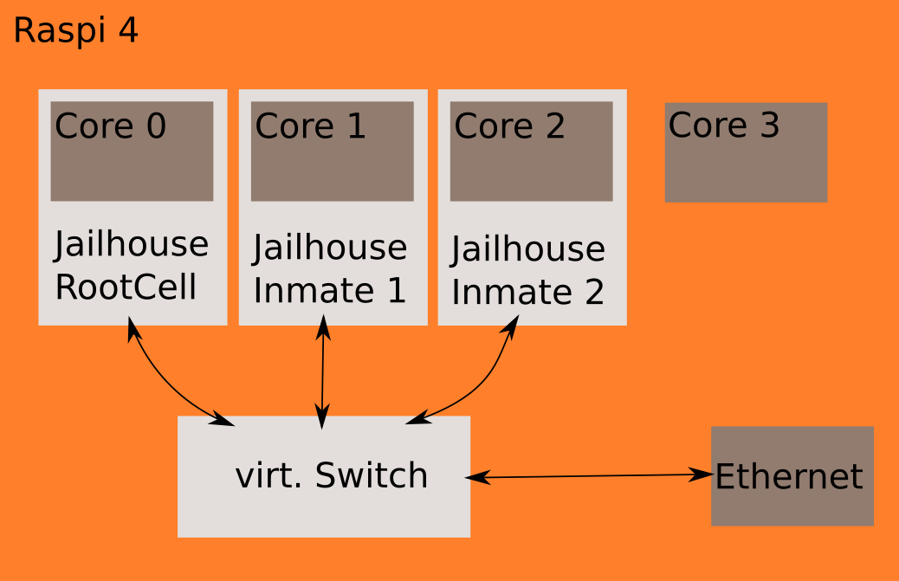

# Übersicht Autojailhouse 

## Flow 

Workflow:
   
```
      +---------------+
      | autojail init |
      +---------------+
               |
               | autojail.yml
               v
  +-----------------------------+
  | autojail extract (optional) |
  +-----------------------------+
               | board.yml
               |            | cells.yml
               v            v
   +---------------------------+
   |     autojail config       |<-------------+
   +---------------------------+              |new cells.yml
               |                     +------------------------------+
               | board.cell          |  autojail explore (optional) |
               | board_guest1.cell   +------------------------------+
               | board_guest...               |
               |                              |
               v                              |
   +---------------------------+              |
   | autojail  test (optional) |--------------+
   +---------------------------+
```


### autojail init

Initialisiert ein autojailhouse Projekt.

Eingaben:

- Kernel build directory
- Jailhouse git url
- Cross compiler
- Base architure (ARM oder ARM64)
- Board identifier oder ssh login      

Ausgaben: Projektkonfiguration  (autojail.yml)

### autojail extract
   
Eingaben: autojail.yml

Ausgaben: board.yml

Datenquellen:

- Device trees
- /proc
    * /iomem
    * ..
- Linux tools
    * lscpu
    * lspci
    * lshw
    * ...
- Optional
    * Microbenchmarks
    * Datenblätter [Google Dialogflow](https://ieeexplore.ieee.org/document/8876925)


#### Beispiel 

Beispiel für Rohdaten/Plattformparameter in boards.yml:

     console: # Wird das hier benötigt (vermutlich nicht)

     irqchips:
	   gic: 
	     address: 0x03881000
         pin_base: 32
         pin_bitmap: 0-128

     memory_regions:
	   uart:
	     virt_start: 0x03020000 #
	     phys_start: 0x03020000 # 
	     size: 100 MB           # 
	     type: PLL01            # Wird auf jeden Fall benötigt wenn wir auf Console Eintrag verzichten
	     linux_driver: ??       # Braucht man das ?
	     devicetree_nodes: ??   # Braucht man das ?
	     root_used: true        # Wird dieses Device / diese Memory Region vom Linux benutzt, wird benutzt um JAILHOUSE_MEM_ROOTSHARED zu inferieren 
		 # evtl. möchte man subregions / subdevices zulassen
		
	  system_ram:
	     virt_start: 
          ...
		  

### autojail config

Eingaben: board.yml, cells.yml, autojail.yml

- Beschreibung der Zellen: cells.yml
    * Manuell erzeugt
    * Enhält sämtliche nicht herleitbaren Informationen
    * Benötigte CPUs, Memory regions, ...

Ausgaben: Konfiguriertes und gebautes Jailhouse Projekt
  - jailhouse/configs/arch/project.cell
  - jailhouse/configs/arch/project-inmate1.cell
  - ...

#### Beispiel

Minimale cells.yml:

	root:
	  name: "My Root Cell"
	  
	guests:
	  guest1: 
		name: "Guest 1"
	 os: bare
	 cpus: 1
	 console: &root.console	 #Implies | MEM_ROOTSHARED
	
	  guest2:
		name: "Guest 2"
		os: Linux
	 cpus: 2,3
	 console: &board.mem_regions_pll1.01
	 
	 mem_regions:
	     memory: 
		    size: 128 MB
		    virtual_start: 0x0
	     timer: 
		    id: &board.hw.timer1 #Reference extracted hardware
		 
		 
	shmem:
	   name: "Shared memory for communication between guest1 und guest2"
	   size: 10 MB
	   protocol: IVETH
	   peers: [guest1, guest2]
	   
cells.yml ohne extraktion einer boards.yml ist eine etwas vereinfachte Konfiguration:

     root:
	   name: "Root Cell"
       console: 
	     address: 0x3100000
		 size: 0x10000,
         type: 8250,
         flags: [ACCESS_MMIO, REGDIST_4]
	   platform_info:
	     gicd_base: 0x03881000
         gicc_base: 0x03882000
         gich_base: 0x03884000
         gicv_base: 0x03886000
         gic_version: 2
         maintenance_irq: 25
		 
	   mem_regions:
	     timer: 
		   phys_start: 0x03020000
           virt_start: 0x03020000
           size: 0xa0000
           flags: [MEM_READ, MEM_WRITE, MEM_EXECUTE]
	   	 
	     uart: 
		   ...
		   
	   irqchips:
	      gic: 
		     address: 0x03881000
             pin_base: 32
             pin_bitmap: 0-128
          gic2: 
             address: 0x03881000 # In jetson tx2 same pin base is this actually correct
			 pin_base: 160
			 pin_bitmap: 0-128
    


#### Ansätze zur Generierung von 

Regelbasierter Ansatz:

- Auf Basis bestehender Jailhouse Konfigurationen
- Identifikation und Berücksichtigung von Metainformationen
- Feedbackmechanismus
    * Zur Erzeugung optimierter Konfigurationen
    * Regelbasiert

Maschinelles Lernen/Hybridverfahren (siehe autojail explore):

- Generierung von Konfigurationen mittels regelbasiertem Ansatz
- Supervised learning mittels Feedbackmechanismus


### autojail test

Eingaben: Jailhouse.yml generiertes jailhouse projekt
Ausgaben: test_results.yml Success / Fail + evtl. Performance Metriken (Latency/Throughput)
          

Startet jailhouse auf Board in der gewählten Konfigurationen. 
Und führt eine oder mehrere Test-Applikationen aus. 

### autojail explore

Eingaben: autojail.yml und test_results.yml
Ausgaben: Neue cells.yml 

TODO: Hier würden wir uns gerne ein wenig austoben. 

## Use Case / Anwendung:

Hier mal die Anforderungsdefinition von Andreas Messerschmid:
 


    ich hatte Ihnen ja noch einen ersten Vorschlag für einen Usecase mit dem
    Raspi 4 und Jailhouse versprochen. Im Anhang finden Sie ein kleines
    Schaubild dazu. Viele Boards (auch im Bereich unserer Industriekunden)
    verfügen nur über ein physikalisches Netzwerkinterface. Beim Einsatz von
    Jailhouse und der Implementierung von einem oder mehreren Gastsystemen,
    ergibt sich immer wieder die Anforderung, dass zum einen die isolierten
    Jailhouse-Zellen untereinander kommunizieren müssen und darüber hinaus
    evtl. auch mit der Aussenwelt über nur ein physikalisch vorhandenes
    Netzwerkinterface. Daher wäre meine Idee in einem ersten Schritt solch
    ein Szenario mit Jailhouse abzubilden. Die Zielsetzung wäre hierbei
    herauszufinden, welche Konfigurationsschritte dafür notwendig sind und
    erste Ideen zu erarbeiten, wie solch einen Konfiguration automatisiert
    erstellt werden kann.

Als konkrete Anwendung bereitet Linutronix gerade einen Demonstrator für X86 vor. 
Dieser basiert auf 2-Zellen. 
Eine mit einer Software SPS basierend auf  https://www.codesys.com/ und Realtime Linux.
Die zweite Zelle Läuft mit einem "normalen" Linux und stellt die GUI oder Weboberfläche dar.

Und hier wäre schon einmal die Anleitung für Codesys auf dem Raspberry https://raspberry-sps.de/codesys-programme-am-raspberry-pi/ .
